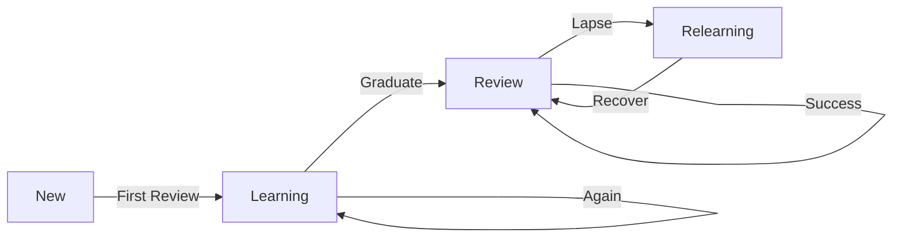

<div align="center">

# flutter_spaced_repetition

<p align="center">
  <strong>A production-ready, pure Dart implementation of spaced repetition algorithms for Flutter and Dart applications.</strong>
</p>

<p align="center">
  <a href="https://pub.dev/packages/flutter_spaced_repetition">
    
  </a>
  <a href="https://opensource.org/licenses/MIT">
    
  </a>
  <a href="https://github.com/makieali/flutter_spaced_repetition/actions">
    
  </a>
</p>

<p align="center">
  <a href="#-features">Features</a> •
  <a href="#-installation">Installation</a> •
  <a href="#-quick-start">Quick Start</a> •
  <a href="#-algorithms">Algorithms</a> •
  <a href="#-documentation">Documentation</a>
</p>

---

</div>

## ✨ Features

<table>
<tr>
<td width="50%">

### 🧠 Multiple Algorithms
- **SM-2** - Classic SuperMemo algorithm
- **SM-2+** - Enhanced with overdue bonus
- **FSRS** - Modern ML-based (20-30% more efficient)
- **Custom** - Build your own algorithm

</td>
<td width="50%">

### 📊 Advanced Analytics
- Forgetting curves visualization
- Workload forecasting
- Retention analysis
- GitHub-style review heatmaps

</td>
</tr>
<tr>
<td width="50%">

### ⚙️ Fully Configurable
- 17+ settings, all functional
- Preset configurations (Anki, SuperMemo)
- Learning steps customization
- Interval bounds control

</td>
<td width="50%">

### 📦 Import/Export
- CSV with custom mapping
- JSON with settings
- Anki text format
- Algorithm migration tools

</td>
</tr>
<tr>
<td width="50%">

### 📈 Statistics
- Per-card analytics
- Deck-level statistics
- Mastery tracking
- Success rate & streaks

</td>
<td width="50%">

### 🚀 Production Ready
- 250+ comprehensive tests
- Pure Dart (no dependencies)
- Works everywhere (Flutter, CLI, server)
- Well documented API

</td>
</tr>
</table>

---

## 📦 Installation

Add this to your package's `pubspec.yaml` file:

```yaml
dependencies:
  flutter_spaced_repetition: ^1.0.0
```

Then run:

```bash
flutter pub get
```

---

## 🚀 Quick Start

```dart
import 'package:flutter_spaced_repetition/flutter_spaced_repetition.dart';

// Create engine with default Anki-like settings
final engine = SpacedRepetitionEngine();

// Create a new card
var card = engine.createCard(id: 'card_1');

// Process a review with quality rating
final result = engine.processReview(card, ReviewQuality.good);
card = result.updatedCard;

// Check next review time
print('Next review: ${card.formattedDueTime}');
print('Interval: ${card.formattedInterval}');

// Preview intervals for UI buttons
final preview = engine.previewIntervals(card);
print('Again: ${preview.formattedAgainInterval}');
print('Good: ${preview.formattedGoodInterval}');
```

---

## 🧠 Algorithms

<details>
<summary><b>SM-2 (Default)</b> - Classic SuperMemo Algorithm</summary>

The classic SuperMemo 2 algorithm by Piotr Wozniak:
- Learning phase with configurable steps
- Ease factor adjustment based on response quality
- Interval calculation: `interval = previous_interval × ease_factor`

```dart
final engine = SpacedRepetitionEngine(
  settings: SRSSettings(algorithmType: SRSAlgorithmType.sm2),
);
```

</details>

<details>
<summary><b>SM-2+</b> - Enhanced Algorithm</summary>

Improved version with better retention:
- Accounts for overdue bonus (successfully recalling overdue cards)
- More nuanced ease factor adjustments
- Smoother interval progression

```dart
final engine = SpacedRepetitionEngine(
  settings: SRSSettings(algorithmType: SRSAlgorithmType.sm2Plus),
);
```

</details>

<details open>
<summary><b>FSRS</b> - Free Spaced Repetition Scheduler ⭐</summary>

Modern ML-based algorithm that is **20-30% more efficient** than SM-2:
- Uses Difficulty-Stability-Retrievability (DSR) memory model
- 21 optimizable parameters learned from research data
- Calculates probability of recall (retrievability)
- More accurate interval predictions

```dart
final engine = SpacedRepetitionEngine(
  settings: SRSSettings(algorithmType: SRSAlgorithmType.fsrs),
);

// Get retrievability (probability of recall)
final retrievability = engine.getRetrievability(card);
print('Chance of recall: ${(retrievability * 100).toStringAsFixed(0)}%');

// Get FSRS state (stability and difficulty)
final state = engine.getFSRSState(card);
print('Stability: ${state?.stability} days');
print('Difficulty: ${state?.difficulty}');

// Get forgetting curve data for visualization
final curve = engine.getForgettingCurve(card, days: 30);

// Get workload forecast
final forecast = engine.getWorkloadForecast(cards, days: 30);
```

</details>

<details>
<summary><b>Custom Algorithm</b> - Build Your Own</summary>

Implement your own algorithm:

```dart
final customAlgorithm = CustomAlgorithm(
  intervalCalculator: (card, quality, settings) {
    // Your custom interval logic
    return Duration(days: card.repetitions + 1);
  },
  easeCalculator: (ease, quality, settings) {
    // Your custom ease factor logic
    return quality == ReviewQuality.easy ? ease + 0.2 : ease;
  },
);

final engine = SpacedRepetitionEngine();
engine.setAlgorithm(customAlgorithm);
```

</details>

---

## 📖 Documentation

### Quality Ratings

| Rating | Value | When to Use |
|:------:|:-----:|:------------|
| `ReviewQuality.again` | 1 | ❌ Complete failure to recall |
| `ReviewQuality.hard` | 2 | 😓 Correct but with difficulty |
| `ReviewQuality.good` | 3 | ✅ Correct with some hesitation |
| `ReviewQuality.easy` | 4 | ⚡ Perfect, instant recall |

### Configuration Presets

```dart
// Standard Anki defaults
final anki = SpacedRepetitionEngine(settings: SRSSettings.anki());

// Original SuperMemo settings
final supermemo = SpacedRepetitionEngine(settings: SRSSettings.supermemo());

// More frequent reviews for faster learning
final aggressive = SpacedRepetitionEngine(settings: SRSSettings.aggressive());

// Fewer reviews for maintenance
final relaxed = SpacedRepetitionEngine(settings: SRSSettings.relaxed());
```

### Custom Configuration

<details>
<summary>View all configurable settings</summary>

```dart
final engine = SpacedRepetitionEngine(
  settings: SRSSettings(
    // Learning phase
    learningSteps: [Duration(minutes: 1), Duration(minutes: 10)],
    graduationsRequired: 2,
    lapsesBeforeLeech: 8,

    // Intervals
    graduatingInterval: Duration(days: 1),
    easyInterval: Duration(days: 4),
    minimumInterval: Duration(days: 1),
    maximumInterval: Duration(days: 365),

    // Ease factor
    initialEaseFactor: 2.5,
    minimumEaseFactor: 1.3,
    easyBonus: 1.3,
    hardIntervalMultiplier: 1.2,
    lapseMultiplier: 0.0,

    // Ease adjustments
    hardEasePenalty: 0.15,
    againEasePenalty: 0.20,
    easyEaseBonus: 0.15,

    // Algorithm
    algorithmType: SRSAlgorithmType.sm2Plus,
    intervalFuzz: 0.05,
  ),
);
```

</details>

---

## 📊 Analytics

### Forgetting Curve

Visualize memory decay over time:

```dart
const curve = ForgettingCurve();

// Generate curve data points
final points = curve.generate(card, days: 30);
for (final point in points) {
  print('Day ${point.daysSinceReview}: ${(point.retrievability * 100).toStringAsFixed(0)}% recall');
}

// Get current retrievability
final currentR = curve.currentRetrievability(card);

// Calculate days until target retention
final daysTo90 = curve.daysUntilTarget(card, 0.9);
```

### Workload Forecast

Predict future review workload:

```dart
const forecast = WorkloadForecast();

// Generate 30-day forecast
final days = forecast.generate(cards, days: 30, newCardsPerDay: 20);
for (final day in days) {
  print('${day.date}: ${day.newCount} new, ${day.reviewCount} reviews');
}

// Get total reviews needed
final total = forecast.estimateTotalReviews(cards, days: 30);

// Get peak workload day
final peak = forecast.getPeakDay(cards, days: 30);
```

### Retention Analytics

```dart
const analytics = RetentionAnalytics();

// Calculate retention rate
final retention = analytics.calculateRetention(history, days: 30);
print('30-day retention: ${(retention * 100).toStringAsFixed(0)}%');

// Get retention by day
final byDay = analytics.retentionByDay(history, days: 30);

// True retention (weighted by difficulty)
final trueRetention = analytics.calculateTrueRetention(history);
```

### Review Heatmap

GitHub-style activity visualization:

```dart
const heatmap = ReviewHeatmap();

// Generate heatmap data
final entries = heatmap.generate(history, weeks: 52);

// Get streak information
final streaks = heatmap.getStreaks(history);
print('Current streak: ${streaks.current} days');
print('Longest streak: ${streaks.longest} days');
```

---

## 📥 Import/Export

### CSV

```dart
// Import from CSV
final result = SRSImporter.fromCSV(
  csvContent,
  mapping: CSVMapping(
    frontColumn: 0,
    backColumn: 1,
    tagsColumn: 2,
    hasHeader: true,
  ),
);

// Export to CSV
final csv = SRSExporter.toCSV(cards);
```

### JSON

```dart
// Import from JSON
final result = SRSImporter.fromJSON(jsonContent);

// Export to JSON
final json = SRSExporter.toJSON(
  cards,
  settings: engine.settings,
  deckName: 'Spanish Vocabulary',
);
```

### Anki Format

```dart
// Import from Anki text format (tab-separated)
final result = SRSImporter.fromAnkiText(textContent);

// Export to Anki text format
final ankiText = SRSExporter.toAnkiText(cards);
```

### Algorithm Migration

```dart
// Migrate from SM-2 to FSRS
final fsrsCards = AlgorithmMigration.sm2ToFSRS(cards);

// Migrate from FSRS to SM-2
final sm2Cards = AlgorithmMigration.fsrsToSM2(cards);
```

---

## 📈 Statistics

<table>
<tr>
<td>

### Card Statistics

```dart
final stats = CardStatistics(card);

print('Total reviews: ${stats.totalReviews}');
print('Success rate: ${stats.successRate}');
print('Current streak: ${stats.currentStreak}');
print('Stability: ${stats.stability}');
```

</td>
<td>

### Deck Statistics

```dart
final deckStats = DeckStatistics(cards);

print('Total cards: ${deckStats.totalCards}');
print('Due today: ${deckStats.dueToday}');
print('Mastered: ${deckStats.masteredCards}');
```

</td>
</tr>
</table>

### Mastery Tracking

```dart
final calculator = MasteryCalculator();
final mastery = calculator.calculate(card);

print('Level: ${mastery.level.label}');   // e.g., "Proficient"
print('Score: ${mastery.score}');         // 0.0 to 1.0
print('Progress: ${mastery.progress}');   // Progress towards mastery
```

---

## 📋 Scheduling

```dart
final scheduler = ReviewScheduler(
  config: SchedulerConfig(
    maxNewCardsPerSession: 20,
    maxReviewsPerSession: 200,
    batchSize: 20,
    mode: SchedulingMode.interleaved,
  ),
);

// Get next batch of cards to review
final batch = scheduler.getNextBatch(allCards);

// Get summary
final summary = scheduler.getSummary(allCards);
print('New: ${summary.newCardsAvailable}');
print('Due: ${summary.totalDue}');
print('Overdue: ${summary.overdueCards}');
```

---

## 🔄 Card Lifecycle



| Phase | Description |
|:------|:------------|
| `CardPhase.isNew` | Never reviewed |
| `CardPhase.learning` | Going through learning steps |
| `CardPhase.review` | Graduated, using spaced intervals |
| `CardPhase.relearning` | Lapsed, re-learning |

```dart
if (card.isNew) print('Card is new');
if (card.isInLearningPhase) print('Card is learning');
if (card.isInReviewPhase) print('Card has graduated');
```

---

## 🛠️ Card Management

```dart
// Check if due
if (engine.isDue(card)) {
  // Show for review
}

// Get due cards
final dueCards = engine.getDueCards(allCards);

// Sort by priority
final sorted = engine.sortByPriority(cards);

// Suspend/Unsuspend
final suspended = engine.suspendCard(card);
final active = engine.unsuspendCard(suspended);

// Reset a card
final reset = engine.resetCard(card);

// Reschedule
final rescheduled = engine.rescheduleCard(card, DateTime(2025, 12, 25));
```

---

## 💾 Metadata

Store application-specific data with each card:

```dart
var card = engine.createCard(
  id: 'vocab_42',
  metadata: {
    'front': 'Hello',
    'back': 'Hola',
    'deck': 'Spanish',
    'tags': ['greetings', 'beginner'],
    'audio': 'hello.mp3',
  },
);

// Access metadata
print(card.metadata?['front']); // "Hello"
```

---

## 🎯 Use Cases

<table>
<tr>
<td align="center" width="25%">
<br>
<b>📚 Flashcard Apps</b>
<br><br>
Language learning, medical study, exam preparation
<br><br>
</td>
<td align="center" width="25%">
<br>
<b>🎓 Educational Platforms</b>
<br><br>
Course content review, knowledge retention
<br><br>
</td>
<td align="center" width="25%">
<br>
<b>📝 PKM Systems</b>
<br><br>
Personal knowledge management, note review
<br><br>
</td>
<td align="center" width="25%">
<br>
<b>🧪 Any Learning App</b>
<br><br>
Anything that benefits from spaced repetition
<br><br>
</td>
</tr>
</table>

---

## 🏭 Used In Production

<table>
<tr>
<td align="center">
<a href="https://github.com/makieali/revisable-app">
<b>Revisable</b>
</a>
<br>
A powerful flashcard app for efficient learning
</td>
</tr>
</table>

---

## 🤝 Contributing

Contributions are welcome! Please feel free to submit a Pull Request.

1. Fork the repository
2. Create your feature branch (`git checkout -b feature/amazing-feature`)
3. Commit your changes (`git commit -m 'Add amazing feature'`)
4. Push to the branch (`git push origin feature/amazing-feature`)
5. Open a Pull Request

---

## 📄 License

This project is licensed under the MIT License - see the [LICENSE](LICENSE) file for details.

---

## 🙏 Acknowledgments

- **SM-2 Algorithm** by Piotr Wozniak
- **FSRS Algorithm** by Jarrett Ye
- Inspired by **Anki** and **SuperMemo**

---

<div align="center">

**[⬆ Back to Top](#flutter_spaced_repetition)**

Made with ❤️ for the learning community

</div>
